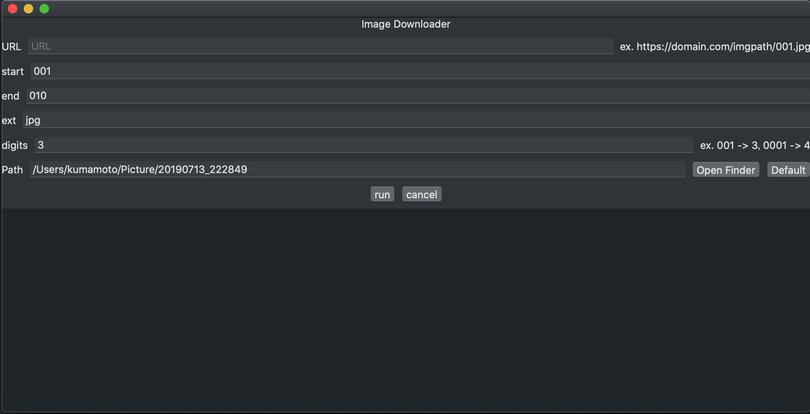

#  EasyImageDownloader

Simple Image Downloader for macOS made by SwiftUI + Combine.

## Feature

* Download sequence number of URLs.
  * e.g. https://domain.com/imgpath/001.jpg 〜 https://domain.com/imgpath/099.jpg

## WIP

* debounce feature https://stackoverflow.com/questions/57010544/ios13s-combine-streams-dont-flow-after-operator-using-schedulers

# License

MIT
